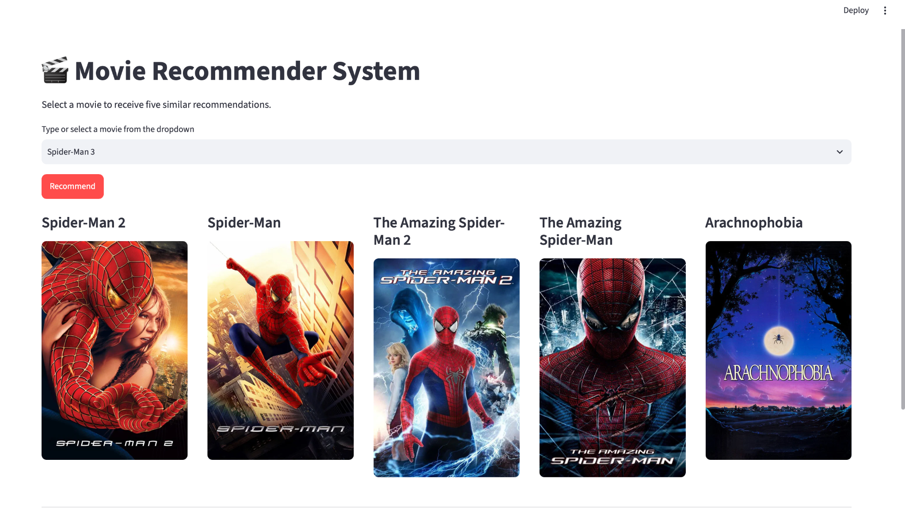

# 🎬 Deep-Learning Movie Recommender System

> A semantic movie recommendation application powered by Sentence Transformers, cosine similarity, Streamlit, and the TMDB API.

<p align="center">
  
  
  
  
  
</p>

<p align="center">
  <a href="#-project-overview">Overview</a> •
  <a href="#-features">Features</a> •
  <a href="#-how-it-works">How It Works</a> •
  <a href="#-installation">Installation</a> •
  <a href="#-project-structure">Project Structure</a>
</p>

---

## 🌟 Project Overview

The **Deep-Learning Movie Recommender System** is an upgraded version of a traditional content-based movie recommender.

Instead of relying only on word counts from `CountVectorizer`, this project uses a pretrained **Sentence Transformer** model to understand the semantic meaning of movie descriptions, genres, cast members, keywords, and directors.

The application allows a user to select a movie and receive five semantically similar recommendations with movie posters fetched from the TMDB API.

### Traditional approach

```text
Movie tags
    ↓
CountVectorizer
    ↓
Bag-of-Words vectors
    ↓
Cosine similarity
```

### Deep-learning approach

```text
Movie tags
    ↓
Sentence Transformer
    ↓
Semantic embeddings
    ↓
Cosine similarity
```

The deep-learning version can identify relationships between movies even when they do not use exactly the same words.

---

## 🚀 Project Links

### Source Code

👉 [View the GitHub repository](https://github.com/saikrishnareddy1731/movie-recommender-system)

### Portfolio

👉 [Explore my portfolio](https://saikrishnareddy1731.github.io/saikrishna-portfolio/index.html)

### LinkedIn

👉 [Connect with me on LinkedIn](https://www.linkedin.com/in/saikrishnareddyragula/)

---

## 🖼️ Application Preview

Keep your application screenshot at:

```text
assets/deep-learning-movie-recommender-preview.png
```

Then GitHub will display it using:

<p align="center">
  
</p>

Recommended screenshot folder:

```text
deep-learning-movie-recommender/
└── assets/
    └── deep-learning-movie-recommender-preview.png
```

---

## ✨ Features

- 🎯 Recommends five semantically similar movies
- 🧠 Uses pretrained Sentence Transformer embeddings
- 🔍 Supports movie selection through a searchable dropdown
- 🖼️ Fetches movie posters dynamically from the TMDB API
- ⚡ Uses normalized embeddings for fast cosine-similarity calculations
- 💾 Stores embeddings in a compact NumPy file
- 📦 Stores processed movie metadata with Pickle
- 💻 Provides an interactive Streamlit user interface
- 🛡️ Handles missing files, API failures, and unavailable posters
- 📊 Displays the similarity score for every recommendation

---

## 🧠 How It Works

The application uses movie metadata from the TMDB 5000 dataset.

### 1. Load the data

The project uses:

- `tmdb_5000_movies.csv`
- `tmdb_5000_credits.csv`

The datasets are merged using the movie title.

### 2. Select useful features

The recommendation system uses:

- Movie overview
- Genres
- Keywords
- Top three cast members
- Director

### 3. Clean and combine text

The selected features are converted into a single `tags` column.

Example:

```text
A marine travels to Pandora action adventure sciencefiction
SamWorthington ZoeSaldana JamesCameron
```

Spaces are removed from multi-word names so they remain meaningful features:

```text
Science Fiction  → ScienceFiction
Sam Worthington  → SamWorthington
James Cameron    → JamesCameron
```

### 4. Generate semantic embeddings

The project uses:

```python
SentenceTransformer("sentence-transformers/all-MiniLM-L6-v2")
```

Each movie is converted into a dense numerical embedding:

```python
embeddings = model.encode(
    new_df["tags"].tolist(),
    batch_size=32,
    show_progress_bar=True,
    convert_to_numpy=True,
    normalize_embeddings=True,
)
```

### 5. Calculate similarity

Because the embeddings are normalized, their dot product is equal to cosine similarity:

```python
scores = embeddings @ embeddings[movie_index]
```

### 6. Rank recommendations

The movies are sorted from the highest similarity score to the lowest:

```python
ranked_indexes = np.argsort(-scores)
```

The selected movie is skipped, and the next five movies are returned.

### 7. Display posters

For every recommended movie, the application sends a request to the TMDB API and displays its poster in Streamlit.

---

## 🔄 Recommendation Pipeline

```text
TMDB Movies Dataset
        ↓
TMDB Credits Dataset
        ↓
Merge both datasets
        ↓
Extract overview, genres, keywords, cast, and director
        ↓
Create combined tags
        ↓
Sentence Transformer
        ↓
Normalized semantic embeddings
        ↓
Cosine similarity
        ↓
Top five recommendations
        ↓
TMDB posters
        ↓
Streamlit application
```

---

## 🧮 Why Sentence Transformers?

A Bag-of-Words model mainly compares exact words.

For example:

```text
space mission alien planet
```

and:

```text
astronaut travels to another world
```

may appear different to a simple word-count model.

A Sentence Transformer can understand that both sentences describe similar ideas.

This produces recommendations based more on meaning than exact vocabulary overlap.

---

## 🛠️ Technology Stack

| Technology | Purpose |
|---|---|
| Python | Core programming language |
| Pandas | Data loading and preprocessing |
| NumPy | Embedding storage and similarity calculations |
| Sentence Transformers | Deep-learning semantic embeddings |
| PyTorch | Backend used by the transformer model |
| Streamlit | Interactive web application |
| Requests | TMDB API communication |
| Pickle | Saving processed movie information |
| TMDB API | Movie poster retrieval |
| Jupyter Notebook | Model development and experimentation |

---

## 📂 Project Structure

```text
deep-learning-movie-recommender/
│
├── app_deep_learning.py
├── deep-learning-movie-recommender.ipynb
├── requirements_deep_learning.txt
├── README.md
├── INSTRUCTIONS.md
│
├── movie_dict.pkl
├── movie_embeddings.npy
│
├── tmdb_5000_movies.csv
├── tmdb_5000_credits.csv
│
└── assets/
    └── deep-learning-movie-recommender-preview.png
```

### File explanation

| File | Description |
|---|---|
| `app_deep_learning.py` | Streamlit application |
| `deep-learning-movie-recommender.ipynb` | Data preprocessing and embedding-generation notebook |
| `requirements_deep_learning.txt` | Required Python packages |
| `movie_dict.pkl` | Movie IDs and titles used by the application |
| `movie_embeddings.npy` | Normalized deep-learning movie embeddings |
| `tmdb_5000_movies.csv` | Original movie metadata |
| `tmdb_5000_credits.csv` | Original cast and crew metadata |
| `assets/` | Application screenshots and visual assets |

---

## ⚙️ Installation

### 1. Clone the repository

```bash
git clone https://github.com/saikrishnareddy1731/movie-recommender-system.git
cd movie-recommender-system
```

### 2. Create a virtual environment

#### macOS or Linux

```bash
python3 -m venv venv
source venv/bin/activate
```

#### Windows

```bash
python -m venv venv
venv\Scripts\activate
```

### 3. Install the dependencies

```bash
python -m pip install -r requirements_deep_learning.txt
```

### 4. Keep the datasets beside the notebook

```text
tmdb_5000_movies.csv
tmdb_5000_credits.csv
```

### 5. Run the notebook

Open:

```text
deep-learning-movie-recommender.ipynb
```

Run every cell from top to bottom.

The first model run downloads the pretrained Sentence Transformer.

After the notebook finishes, confirm that these files exist:

```text
movie_dict.pkl
movie_embeddings.npy
```

### 6. Run the Streamlit app

```bash
python -m streamlit run app_deep_learning.py
```

Open the local address shown in the terminal, usually:

```text
http://localhost:8501
```

---

## 📦 Requirements

The included requirements file contains:

```text
streamlit
pandas
numpy
requests
sentence-transformers
```

Install all dependencies with:

```bash
python -m pip install -r requirements_deep_learning.txt
```

---

## 📊 Output Files

### `movie_dict.pkl`

Contains the movie IDs and titles needed by the Streamlit application.

Example:

```python
{
    "movie_id": {0: 19995, 1: 285, ...},
    "title": {0: "Avatar", 1: "Pirates of the Caribbean", ...}
}
```

### `movie_embeddings.npy`

Contains the normalized semantic embedding for every movie.

Example shape:

```text
(number_of_movies, embedding_dimension)
```

For `all-MiniLM-L6-v2`, the embedding dimension is typically 384.

This approach avoids saving a full movie-by-movie similarity matrix.

---

## ⚖️ Traditional ML vs Deep Learning

| Feature | Traditional Version | Deep-Learning Version |
|---|---|---|
| Text representation | CountVectorizer | Sentence Transformer |
| Vector type | Sparse word counts | Dense semantic embeddings |
| Meaning awareness | Limited | Stronger |
| Exact word dependence | High | Lower |
| Saved model output | Similarity matrix | Embedding matrix |
| Recommendation quality | Keyword-based | Semantic |
| Compute requirement | Lower | Higher |

---

## 🧪 Example Recommendation

When a user selects:

```text
Spider-Man 3
```

the system analyzes the semantic embedding of that movie and compares it with all other movie embeddings.

Possible recommendations may include:

```text
Spider-Man 2
Spider-Man
The Amazing Spider-Man
The Amazing Spider-Man 2
Another superhero or action movie with similar themes
```

Results depend on the final cleaned metadata and model embeddings.

---

## 🔐 API Key Security

Do not publish a real TMDB API key directly in the source code.

For a public project, create:

```text
.streamlit/secrets.toml
```

Add:

```toml
TMDB_API_KEY = "YOUR_TMDB_API_KEY"
```

Then access it in Streamlit:

```python
TMDB_API_KEY = st.secrets["TMDB_API_KEY"]
```

Add the secrets file to `.gitignore`:

```gitignore
.streamlit/secrets.toml
```

Because the current API key has already been shown publicly, regenerate it before publishing the application.

---

## 🚀 Future Improvements

- Add movie ratings and release dates
- Display movie descriptions and genres
- Add movie trailers
- Add language and genre filters
- Add user watchlists
- Add recommendation explanations
- Fine-tune the transformer model on movie metadata
- Combine semantic embeddings with user ratings
- Build a hybrid recommendation system
- Add approximate nearest-neighbor search with FAISS
- Deploy the application with Streamlit Community Cloud
- Add caching for API responses
- Add automated tests
- Add Docker support

---

## 📚 What I Learned

This project improved my understanding of:

- Deep-learning-based text embeddings
- Sentence Transformers
- Semantic similarity
- Data preprocessing
- Feature engineering
- Normalized vector representations
- Efficient NumPy operations
- Recommendation-system development
- Streamlit application development
- TMDB API integration
- Saving and loading machine-learning artifacts
- Moving from a notebook experiment to a usable web application

---

## 🤝 Contributing

Contributions and suggestions are welcome.

1. Fork the repository
2. Create a feature branch
3. Commit your changes
4. Push the branch
5. Open a pull request

---

## ⭐ Support

If you find this project useful:

- Give the repository a ⭐
- Share it with other learners
- Suggest a feature
- Connect with me on LinkedIn
- Explore more projects through my portfolio

---

## 👤 Author

**Saikrishna Reddy Ragula**

- 🌐 Portfolio: [View my portfolio](https://saikrishnareddy1731.github.io/saikrishna-portfolio/index.html)
- 💻 GitHub: [saikrishnareddy1731](https://github.com/saikrishnareddy1731)
- 💼 LinkedIn: [Saikrishna Reddy Ragula](https://www.linkedin.com/in/saikrishnareddyragula/)

---

## 🙏 Acknowledgements

- TMDB for movie metadata and poster services
- Sentence Transformers for pretrained semantic embedding models
- Streamlit for the web application framework
- Scikit-learn and the Python machine-learning community
- The open-source community for educational resources and inspiration

---

## ⚠️ TMDB Attribution

This product uses the TMDB API but is not endorsed or certified by TMDB.

---

<p align="center">
  Built with ❤️, Python, deep learning, and a love for movies.
